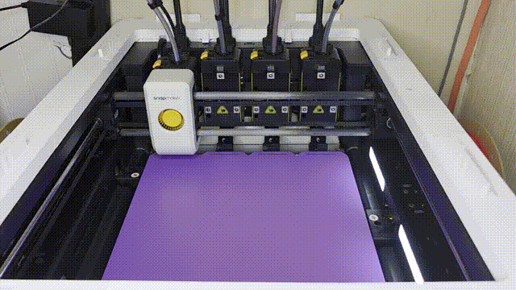

# Orca Auto

Headless OrcaSlicer automation. Two things, sharing one slicing core:

- a **web UI + REST API** for batch-slicing STL/3MF/SCAD against your own profiles, and
- **`orca-auto u1`** — a command-line **multicolor pipeline for the Snapmaker U1** that
  turns a JSON job spec into a queued print without a GUI anywhere in the loop.

## Snapmaker U1 in 60 seconds

The U1 is a 4-tool multicolor toolchanger. Assigning parts to tools normally means
driving the slicer by hand. This makes it a file you can generate, diff, and script:

```json
{
  "parts": [
    { "stl": "shell.stl", "tool_index": 0, "filament": "PLA",                 "color": "#519F61" },
    { "stl": "inlay.stl", "tool_index": 1, "filament": "Snapmaker PLA Matte @U1", "color": "#111111" }
  ]
}
```

```bash
orca-auto u1 print job.json --moonraker http://<u1-host> --mode queue
```

That single command assembles a multicolor project `.3mf`, slices it headlessly, and
drops the G-code straight into the printer's queue over Moonraker.


*Black/white "Articulated Orca" ([Jopek Design](https://www.printables.com/model/770930), print-in-place)
assigned to two tools by colour, sliced headlessly, and printed on a real U1 with no GUI in the loop.
2h16m compressed to 5s.*

It also asks the printer what is loaded and uses each spool's own tagged temperatures.

**Filament assignments are real, not cosmetic.** Each slot's settings are resolved out
of OrcaSlicer's installed Snapmaker bundle — `"PLA"` resolves to `Snapmaker PLA @U1` and
brings its actual temperatures, flow, cooling and retraction with it. Name a filament the
bundle doesn't have and it fails loudly rather than printing one material at another's
temperature. [Full details below](#snapmaker-u1-slice-coordinator).

Requires a U1 running Klipper/Moonraker (stock firmware is fine) and OrcaSlicer on the
machine you run it from. No account, no cloud, no vendor slicer.

## Features

- **Snapmaker U1 multicolor pipeline** - JSON job spec → project `.3mf` → headless slice → Moonraker queue, in one command
- **Web UI** - Browse files, select profiles, and slice with one click
- **Batch Slicing** - Select multiple files and slice them all at once
- **Multi-Printer Support** - Import profiles for different printers and switch between them
- **Profile Import** - Import .orca_printer profile bundles from OrcaSlicer
- **Dynamic Filtering** - Profiles automatically filter based on selected machine
- **Filament Selection** - Choose filaments with automatic filtering by printer compatibility
- **Job Queue** - Background job processing with status tracking
- **CLI Tool** - Command-line interface for scripting and automation
- **Real filament resolution** - U1 tool assignments pull their settings from Snapmaker's own filament profiles, so a slot is heated like the material it claims to be
- **Reads the spools you actually loaded** - RFID tags supply each spool's own temperatures, and a material mismatch stops the job instead of ruining it
- **Pick tools by colour, not slot** - say "black", not "tool 3"; job specs survive reloading spools in a different order
- **Support release materials** - designate a PETG spool as support interface for PLA/ASA prints and take the support gap to zero for a flat, clean-peeling surface

## Screenshots


*First-run setup wizard guides you through configuration*

## Requirements

- Linux server (tested on Ubuntu 24.04)
- OrcaSlicer installed (headless mode with Xvfb)
- Python 3.11+

## Quick Start

1. **Clone the repository**
   ```bash
   git clone https://github.com/3DCreationsByChad/orca-auto.git
   cd orca-auto
   ```

2. **Run the setup script** (creates a venv, installs dependencies, copies `.env.example` → `.env`)
   ```bash
   ./setup.sh
   ```

   Or install manually:
   ```bash
   python3 -m venv venv
   source venv/bin/activate
   pip install -e .
   cp .env.example .env
   ```

3. **Run the server**
   ```bash
   source venv/bin/activate
   uvicorn orca_api.main:app --host 0.0.0.0 --port 8000
   ```

4. **Complete the setup wizard**

   Visit `http://localhost:8000/ui` — on first run, you'll be automatically redirected to the setup wizard which guides you through:
   - Configuring your STL models directory
   - Setting the sliced output directory
   - Specifying the OrcaSlicer binary path
   - Importing printer profiles (.orca_printer bundles)

   After completing the wizard, your app is ready to use!

## CLI Setup (Alternative)

For headless servers without browser access, run the interactive CLI setup:

```bash
orca-auto setup
```

This provides the same configuration wizard via command line — prompting for paths, creating directories if needed, and importing profiles.

## Installation Prerequisites

### OrcaSlicer Setup

Verified on Ubuntu 24.04. Pick the AppImage built for your distro release.

```bash
# Download and extract the AppImage
sudo mkdir -p /opt/orcaslicer && cd /opt/orcaslicer
sudo curl -L -o OrcaSlicer-2.3.1.AppImage \
  https://github.com/OrcaSlicer/OrcaSlicer/releases/download/v2.3.1/OrcaSlicer_Linux_AppImage_Ubuntu2404_V2.3.1.AppImage
sudo chmod +x OrcaSlicer-2.3.1.AppImage
sudo ./OrcaSlicer-2.3.1.AppImage --appimage-extract && sudo mv squashfs-root 2.3.1
sudo ln -s /opt/orcaslicer/2.3.1/AppRun /usr/local/bin/orcaslicer

# The AppImage does NOT bundle these. Without them the binary dies with
# "error while loading shared libraries: libgstreamer-1.0.so.0" and the slice
# fails as rc=127 — check with:
#   LD_LIBRARY_PATH=/opt/orcaslicer/2.3.1/bin ldd /opt/orcaslicer/2.3.1/bin/orca-slicer | grep 'not found'
sudo apt install -y libwebkit2gtk-4.1-0 libgstreamer1.0-0 libgstreamer-plugins-base1.0-0

# Install the vendor profile bundle into the datadir. `u1 slice` resolves every
# filament's real settings out of <datadir>/system/<Vendor>/filament/*.json, so
# without this you get "no filament preset matches ... Available U1 presets: (none)".
mkdir -p ~/.config/OrcaSlicer/system
cp -a /opt/orcaslicer/2.3.1/resources/profiles/. ~/.config/OrcaSlicer/system/
```

### Virtual Display (for headless servers)

The CLI needs an X display even when it never draws anything. `u1 slice` defaults
to `DISPLAY=:99`, so give it a permanent one rather than a shell-scoped `&` job:

```bash
sudo apt install xvfb
sudo tee /etc/systemd/system/xvfb99.service >/dev/null <<'UNIT'
[Unit]
Description=Xvfb virtual framebuffer on :99 (headless OrcaSlicer CLI)
After=network.target

[Service]
ExecStart=/usr/bin/Xvfb :99 -screen 0 1280x1024x24 -nolisten tcp
Restart=always
RestartSec=2

[Install]
WantedBy=multi-user.target
UNIT
sudo systemctl enable --now xvfb99.service
```

OpenGL still fails under Xvfb (`glfwInit return error` / `Unable to init glew`),
which only costs you the `.3mf` thumbnails. Slicing itself is unaffected.

### Profiles Directory

```bash
sudo mkdir -p /opt/orcaslicer/profiles/imported
sudo chown -R $USER:$USER /opt/orcaslicer/profiles
```

## Configuration Reference

The setup wizard handles configuration automatically. For advanced users or manual configuration, set these environment variables in `.env`:

| Variable | Default | Description |
|----------|---------|-------------|
| `ORCA_MODELS_PATH` | `/data/models` | Root directory for STL file browser |
| `ORCA_SLICED_PATH` | `/data/output` | Where sliced files are saved |
| `ORCA_PROFILES_PATH` | `/opt/orcaslicer/profiles` | Path to profiles |
| `ORCA_ORCASLICER_BIN` | `/usr/local/bin/orcaslicer` | OrcaSlicer binary |
| `ORCA_OPENSCAD_BIN` | `/usr/bin/openscad` | OpenSCAD binary, used only by the SCAD-to-STL export pipeline |
| `ORCA_JOBS_FILE` | `./data/jobs.json` | Job queue persistence file |
| `ORCA_API_HOST` | `0.0.0.0` | API server bind host |
| `ORCA_API_PORT` | `8000` | API server port |
| `ORCA_DEBUG` | `false` | Enable debug logging |

These map 1:1 to `.env.example` — copy it to `.env` and edit as needed (`setup.sh` does this for you).

## Usage

### Web UI

Visit `http://your-server:8000/ui` to access the web interface.

1. Navigate to your STL files
2. Select machine profile (if using imported profiles)
3. Choose slicing profile and filament
4. Click "Slice" or select multiple files for batch slicing

### CLI

```bash
# Slice a single file
orca-auto slice /path/to/model.stl --profile standard

# Slice with specific machine
orca-auto slice /path/to/model.stl --profile "0.20mm Standard" --machine "My Printer"

# List available profiles
orca-auto profiles
```

### API

```bash
# Slice a file
curl -X POST http://localhost:8000/api/slice \
  -F "file_path=/path/to/model.stl" \
  -F "profile=standard"

# List profiles
curl http://localhost:8000/api/profiles

# Import profiles
curl -X POST http://localhost:8000/api/profiles/import \
  -F "file=@my-profiles.orca_printer"
```

### Snapmaker U1 Slice-Coordinator

`orca-auto` includes a separate, local `u1` command group for the **Snapmaker U1**, a 4-tool multicolor toolchanger printer. Unlike the rest of the CLI (which is a thin HTTP client over the running API), `orca-auto u1` runs the full pipeline directly on the machine you invoke it from — it doesn't need the API server running at all.

The pipeline is: **build** a multicolor project `.3mf` from your STLs + per-part tool/filament assignments → **slice** it headlessly with OrcaSlicer (using the project-`.3mf` recipe documented in [`docs/headless-slicing-findings-2026-06-11.md`](docs/headless-slicing-findings-2026-06-11.md), which bypasses OrcaSlicer's vendor-bundle compatibility check) → optionally **push** the resulting G-code straight to the printer's [Moonraker](https://moonraker.readthedocs.io/) API.

1. **Write a job spec** — a JSON file listing each STL and which of the U1's 4 tools/filaments it prints with:
   ```json
   {
     "parts": [
       { "stl": "part-a.stl", "tool_index": 0, "filament": "PLA", "color": "#519F61" },
       { "stl": "part-b.stl", "tool_index": 1, "filament": "PLA", "color": "#000000" }
     ]
   }
   ```
   Paths resolve relative to the job file's directory unless given as absolute paths.

   **A part can name its source instead of an STL.** Give it a `.scad` plus optional
   `params`, and the render happens as part of the job:

   ```json
   { "parts": [
       { "scad": "card-base.scad",  "params": {"FACE_DOWN": true},
         "color": "#F4C032", "filament": "PLA" },
       { "scad": "card-inlay.scad", "params": {"FACE_DOWN": true},
         "color": "#080A0D", "filament": "PLA" }
   ]}
   ```

   Rendered STLs land in `<workdir>/scad/`, named after the source *and its params*, so
   two variants of one file never overwrite each other. A render is skipped while its STL
   stays newer than every file in the source's **include graph** — not just the file you
   named. That distinction is the whole point: entry files are usually a few lines and all
   the geometry lives in what they `include`, so an mtime check against the named file
   alone happily reuses an STL that predates the edit you just made, and prints the
   previous design without complaining.

   An empty render is an error, not a pass. OpenSCAD exits 0 when the top-level object
   turns out not to be 3D — a broken `include` path does exactly this — leaving a valid
   STL with no facets that slices and prints as nothing. The facet count is checked and
   the useless file is deleted rather than left behind looking fresh.

   `--openscad` picks the binary, `--scad-timeout` raises the 900s ceiling (CGAL on a full
   plate of text and QR geometry takes minutes), and `--force-scad` re-renders regardless.

   **`filament` names a real preset, and its settings are actually applied.** The
   project `.3mf` this tool builds embeds a *fully resolved* config — that is what lets
   it bypass OrcaSlicer's vendor-bundle compatibility check — which means OrcaSlicer
   slices from the values embedded in the file, not from a preset name. So each slot's
   settings are read out of OrcaSlicer's installed Snapmaker bundle and spliced in:
   temperatures, bed temperature, flow, cooling, retraction, the lot.

   Write either a bare material or a specific profile:

   | `filament` | resolves to |
   |---|---|
   | `"PLA"` / `"ASA"` / `"PETG"` / `"TPU"` | `Snapmaker <material> @U1` |
   | `"Snapmaker PLA Matte @U1"` | itself |
   | `"PolyLite PLA @U1"` | itself |

   List what your install actually offers:

   ```python
   from orca_api.u1.filament_presets import available_presets
   print([n for n in available_presets("~/.config/OrcaSlicer") if n.endswith("@U1")])
   ```

   A filament with no matching preset raises `FilamentPresetError` listing the valid
   options. That is deliberate: the alternative is a slot labelled one material and
   heated like another, which slices into perfectly healthy-looking G-code and ruins
   the print. Slots you don't assign keep the template's defaults.

   **The printer gets the final say on temperature.** The U1 reads an RFID tag on
   every Snapmaker spool and publishes it over Moonraker, and those tags carry the
   manufacturer's own figures for that exact filament — which are not always what the
   generic profile says. A PLA SnapSpeed spool tags **230 °C for the first layer and a
   60 °C bed**, where `Snapmaker PLA @U1` says 220 °C / 55 °C. `orca-auto u1 print` asks
   the printer what is loaded *before* slicing and uses the spool's own values.

   See what your machine is holding right now:

   ```bash
   orca-auto u1 filaments --moonraker http://<u1-host>
   ```
   ```
   tool 1: PLA SnapSpeed   #080A0D  first layer 230C / then 220C / bed 60C  (Snapmaker)
   tool 2: PLA SnapSpeed   #F4C032  first layer 230C / then 220C / bed 60C  (Snapmaker)
   tool 3: not tagged - the printer cannot identify it
   tool 4: not tagged - the printer cannot identify it
   ```

   Three rules this follows:

   - **Untagged spools keep the profile.** Third-party filament has no tag, and the
     printer reports the slot as `NONE` — that is *unknown*, not empty and not
     "probably PLA".
   - **Absurd tags are ignored.** A temperature outside the spool's own declared
     hotend range is treated as corrupt rather than sent to a heater.
   - **Material mismatches are refused.** Ask for PLA on a tool holding ABS and the
     job stops with the tool number, instead of printing one material at another's
     temperature.

   Pass `--no-read-filament` to skip all of this and use the profile as-is.

   **Name a colour instead of a slot.** Because the printer reports each tool's
   colour, a part can say which filament it wants rather than which socket it sits in:

   ```json
   { "parts": [
       { "stl": "shell.stl", "color": "black",   "filament": "PLA" },
       { "stl": "inlay.stl", "color": "#F4C032", "filament": "PLA" }
   ]}
   ```

   Reload your spools in a different order and the same job still prints correctly.
   Hex values and common names both work; `tool_index` still wins if you give it.
   Two spools too alike to tell apart, or a colour that isn't loaded, stops the job
   rather than picking the least-wrong tool.

   **Designate a spool as support material.** Body and interface are separate:

   ```json
   { "support": { "interface": "PETG", "body": "PLA" },
     "parts": [ ... ] }
   ```

   PETG barely bonds to PLA or ASA. Print the support *interface* in PETG under a
   PLA part and it peels off in one piece — so the support gap is closed to **zero**
   and the support-facing surface comes out flat instead of scarred. The material
   incompatibility does the releasing that an air gap normally does badly.

   That only holds while the materials genuinely don't bond, so the gap is closed
   **only when every part on the plate is a material the interface releases from**.
   One PETG part in the plate keeps the air gap — it would weld to its supports. A
   PLA interface under a PLA part never closes the gap.

   Either field takes a material name (resolved against the loaded spools) or an
   explicit tool index. Asking for a material you haven't loaded stops the job and
   lists what you have.

   > Status: the release-gap logic is unit-tested and the generated config verified
   > against a real U1, but a physical PETG-interface print hasn't been run yet.

   **One model split by colour — `"assembly": true`.** By default each STL is its own
   object on the plate, which is what a plate of unrelated parts wants: they get laid
   out side by side and arranged. That is exactly wrong for a *single* model exported
   as one STL per colour, because the parts share an origin and are supposed to land
   on top of each other:

   ```json
   { "assembly": true,
     "parts": [
       { "stl": "card-body.stl",    "color": "#F4C032", "filament": "PLA" },
       { "stl": "card-artwork.stl", "color": "#080A0D", "filament": "PLA" }
   ]}
   ```

   With `assembly`, the STLs become parts of one object with identity transforms, so
   their authored coordinates are preserved exactly and each part keeps its own tool.
   Without it, a two-colour card slices and prints happily as a blank card next to a
   floating sheet of lettering — the failure is invisible in the G-code's statistics.

   **Override slicer settings — `"process"`.** Raw project-config keys, applied last:

   ```json
   { "process": { "wall_generator": "arachne" }, "parts": [ ... ] }
   ```

   Unvalidated on purpose — OrcaSlicer owns that key namespace, and a whitelist here
   would go stale every release. Useful for thin features: `arachne` varies wall width
   to fill a 1mm QR module that the classic generator would leave hollow.

   **Name what the printer's screen shows — `"name"`.** Optional; the job spec's own
   filename is used when it is absent, with a redundant `job-` prefix dropped
   (`job-card-3up.json` → `card-3up.gcode`). `--name` overrides both.

   ```json
   { "name": "quad-lock-card-3up", "parts": [ ... ] }
   ```

   Without this every job uploaded as `job.gcode`, so each one overwrote the last and
   the printer's file list held a single unidentifiable entry. Names are sanitised
   before they touch the filesystem or the upload — a job spec cannot steer either out
   of its own tree.

   **Keep a dated history — `"date_suffix"`.** Off by default. On, the export
   date is stamped into the name: `card-3up(08.13.26).gcode`. `--date-suffix` /
   `--no-date-suffix` override the spec.

   ```json
   { "date_suffix": true, "parts": [ ... ] }
   ```

   Naming a job stops it from overwriting *other* jobs; this stops a re-slice
   from overwriting *itself*, so last week's known-good plate is still on the
   printer when this week's revision disappoints. Putting the date in the title
   rather than leaning on the filesystem also survives leaving the filesystem —
   file managers hide and reorder metadata columns, some cannot keyword-search
   them, and none of it comes along on import elsewhere.

   ⚠️ Zero-padded (`08.13.26`), because unpadded `10.1.26` sorts before
   `8.13.26` and a list that reads in order is the entire point. Same-day
   re-slices deliberately collide: one file per design per day, not per slice.

   **On-screen previews are embedded automatically.** The U1 draws its thumbnail from
   one baked into the G-code, and OrcaSlicer's *CLI* never writes one — the config
   carries `thumbnails = 48x48/PNG, 300x300/PNG` all the way through, but the headless
   path has no renderer, so the exported `.3mf` contains no image at all. `orca-auto`
   renders the plate with OpenSCAD instead and splices in 48x48 and 300x300 blocks in
   the format Snapmaker Orca emits. Pass `--no-thumbnails` to skip it. A failed render
   is logged and the job continues — a missing picture costs a picture; a raised
   exception would cost the print, after the slice has already been paid for.

2. **Slice only** (build the `.3mf` + G-code, no printer needed):
   ```bash
   orca-auto u1 slice job.json --out job.gcode --bin /usr/local/bin/orcaslicer
   ```

3. **Slice and push to the printer** via Moonraker:
   ```bash
   orca-auto u1 print job.json \
     --moonraker http://<printer-host-or-ip> \
     --api-key "$MOONRAKER_API_KEY" \
     --mode queue \
     --bin /usr/local/bin/orcaslicer
   ```
   `--mode queue` uploads and enqueues the file; `--mode start` uploads and starts printing immediately. `--api-key` is optional and only needed if your Moonraker instance requires one.

Both subcommands accept `--datadir` (OrcaSlicer's config directory) and `--display` (the X `DISPLAY` for headless slicing, e.g. via Xvfb — see [Virtual Display](#virtual-display-for-headless-servers) above) to match your environment. Run `orca-auto u1 slice --help` / `orca-auto u1 print --help` for the full flag list.

## Project Structure

```
src/orca_api/            # FastAPI service (web UI + REST API)
├── main.py               # FastAPI application, job-queue lifespan, setup-redirect middleware
├── config.py             # Pydantic Settings (ORCA_* env vars)
├── models.py              # Pydantic request/response models
├── routers/
│   ├── files.py            # File browser endpoints
│   ├── jobs.py              # Job queue endpoints
│   ├── pipeline.py           # SCAD -> STL -> slice -> queue pipeline endpoints
│   ├── profiles.py           # Profile listing/import endpoints
│   ├── scad.py                # SCAD file browsing/param editing endpoints
│   ├── slice.py                 # Slice-job endpoints
│   └── ui.py                     # Web UI routes (setup wizard, index, editors)
├── services/
│   ├── slicer.py           # OrcaSlicer CLI wrapper (standard slice path)
│   ├── job_queue.py          # Background job processing
│   ├── profile_import.py       # .orca_printer profile import
│   ├── scad_parser.py            # OpenSCAD parameter parsing
│   ├── scad_exporter.py           # SCAD-to-STL export via OpenSCAD CLI
│   └── file_browser.py             # STL/file browser service
├── templates/             # Jinja2 HTML templates (setup wizard, index, editors)
└── u1/                    # Snapmaker U1 slice-coordinator (see above)
    ├── threemf_builder.py   # Assemble a multicolor project .3mf
    ├── filament_presets.py    # Resolve real filament settings from the vendor bundle
    ├── loaded_filament.py       # What the RFID tags say is physically in each tool
    ├── tool_resolution.py         # Find the tool holding a colour or a material
    ├── support.py                   # Support body/interface material designation
    ├── slice.py                 # Headless OrcaSlicer CLI wrapper
    ├── moonraker_client.py        # Async Moonraker REST client
    ├── tool_map.py                  # 4-tool color/filament assignment model
    └── pipeline.py                    # build -> slice -> (optionally) push

src/orca_cli/             # `orca-auto` CLI (argparse)
├── cli.py                  # Subcommands, most of which are thin HTTP clients over the API
├── client.py                 # OrcaClient httpx wrapper
├── config.py                   # CLI's own config file (~/.config/orca-auto/config.json)
├── setup.py                      # Interactive setup wizard (CLI equivalent of /ui/setup)
└── u1_cmd.py                       # `orca-auto u1` subcommands (host-local, no API call)
```

## Troubleshooting

### Setup wizard not appearing

**Cause:** App may already be configured (paths exist and profile imported).

**Solution:** Delete the `.env` file and restart the server, or manually visit `/ui/setup` to re-run the wizard.

### "OrcaSlicer binary not found" error

**Cause:** Binary path is incorrect or the file is not executable.

**Solution:** Verify the path in the setup wizard. Ensure the file exists and has execute permission:
```bash
ls -la /path/to/orcaslicer
chmod +x /path/to/orcaslicer
```

### Profiles not importing

**Cause:** Invalid `.orca_printer` file format or permission issues.

**Solution:** Ensure the file is a valid `.orca_printer` bundle exported from OrcaSlicer (File > Export > Export Configs). Check that the profiles directory is writable.

### Slicing fails with "Display not found"

**Cause:** Xvfb virtual display is not running or DISPLAY environment variable is not set.

**Solution:** Start Xvfb and set the display:
```bash
Xvfb :99 -screen 0 1024x768x24 &
export DISPLAY=:99
```

### Web UI shows blank page

**Cause:** Templates not found, usually because the app is not running from the project root.

**Solution:** Install the package in development mode and run uvicorn from the project root:
```bash
pip install -e .
uvicorn orca_api.main:app --host 0.0.0.0 --port 8000
```

## Using with Claude Code

This project includes a `CLAUDE.md` that gives Claude Code full context on the architecture, commands, and configuration.

```bash
claude    # Start Claude Code — reads CLAUDE.md automatically
```

## License

MIT License - see LICENSE file for details.

## Contributing

Contributions welcome! See [CONTRIBUTING.md](CONTRIBUTING.md) for development setup, the PR workflow, and testing conventions.
