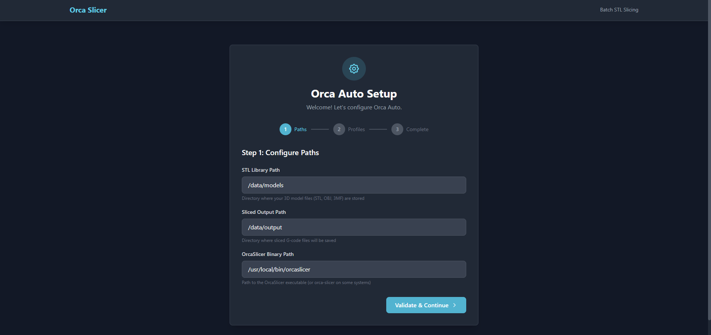

# Orca Auto

A web-based automation tool for OrcaSlicer that enables batch slicing of STL files with customizable profiles.

## Features

- **Web UI** - Browse files, select profiles, and slice with one click
- **Batch Slicing** - Select multiple files and slice them all at once
- **Multi-Printer Support** - Import profiles for different printers and switch between them
- **Profile Import** - Import .orca_printer profile bundles from OrcaSlicer
- **Dynamic Filtering** - Profiles automatically filter based on selected machine
- **Filament Selection** - Choose filaments with automatic filtering by printer compatibility
- **Job Queue** - Background job processing with status tracking
- **CLI Tool** - Command-line interface for scripting and automation
- **Snapmaker U1 Slice-Coordinator** - Local build → slice → push pipeline that assembles a multicolor `.3mf` project and sends the resulting G-code straight to a U1's Moonraker instance (see [Snapmaker U1 Slice-Coordinator](#snapmaker-u1-slice-coordinator) below)

## Screenshots


*First-run setup wizard guides you through configuration*

## Requirements

- Linux server (tested on Ubuntu 24.04)
- OrcaSlicer installed (headless mode with Xvfb)
- Python 3.11+

## Quick Start

1. **Clone the repository**
   ```bash
   git clone https://github.com/3DCreationsByChad/orca-auto.git
   cd orca-auto
   ```

2. **Run the setup script** (creates a venv, installs dependencies, copies `.env.example` → `.env`)
   ```bash
   ./setup.sh
   ```

   Or install manually:
   ```bash
   python3 -m venv venv
   source venv/bin/activate
   pip install -e .
   cp .env.example .env
   ```

3. **Run the server**
   ```bash
   source venv/bin/activate
   uvicorn orca_api.main:app --host 0.0.0.0 --port 8000
   ```

4. **Complete the setup wizard**

   Visit `http://localhost:8000/ui` — on first run, you'll be automatically redirected to the setup wizard which guides you through:
   - Configuring your STL models directory
   - Setting the sliced output directory
   - Specifying the OrcaSlicer binary path
   - Importing printer profiles (.orca_printer bundles)

   After completing the wizard, your app is ready to use!

## CLI Setup (Alternative)

For headless servers without browser access, run the interactive CLI setup:

```bash
orca-auto setup
```

This provides the same configuration wizard via command line — prompting for paths, creating directories if needed, and importing profiles.

## Installation Prerequisites

### OrcaSlicer Setup

```bash
# Download and extract OrcaSlicer AppImage
wget https://github.com/SoftFever/OrcaSlicer/releases/download/v2.3.1/OrcaSlicer_Linux_V2.3.1.AppImage
chmod +x OrcaSlicer_Linux_V2.3.1.AppImage
./OrcaSlicer_Linux_V2.3.1.AppImage --appimage-extract
sudo mv squashfs-root /opt/orcaslicer/orca-slicer-extracted
sudo ln -s /opt/orcaslicer/orca-slicer-extracted/AppRun /usr/local/bin/orcaslicer
```

### Virtual Display (for headless servers)

```bash
sudo apt install xvfb
Xvfb :99 -screen 0 1024x768x24 &
export DISPLAY=:99
```

### Profiles Directory

```bash
sudo mkdir -p /opt/orcaslicer/profiles/imported
sudo chown -R $USER:$USER /opt/orcaslicer/profiles
```

## Configuration Reference

The setup wizard handles configuration automatically. For advanced users or manual configuration, set these environment variables in `.env`:

| Variable | Default | Description |
|----------|---------|-------------|
| `ORCA_MODELS_PATH` | `/data/models` | Root directory for STL file browser |
| `ORCA_SLICED_PATH` | `/data/output` | Where sliced files are saved |
| `ORCA_PROFILES_PATH` | `/opt/orcaslicer/profiles` | Path to profiles |
| `ORCA_ORCASLICER_BIN` | `/usr/local/bin/orcaslicer` | OrcaSlicer binary |
| `ORCA_OPENSCAD_BIN` | `/usr/bin/openscad` | OpenSCAD binary, used only by the SCAD-to-STL export pipeline |
| `ORCA_JOBS_FILE` | `./data/jobs.json` | Job queue persistence file |
| `ORCA_API_HOST` | `0.0.0.0` | API server bind host |
| `ORCA_API_PORT` | `8000` | API server port |
| `ORCA_DEBUG` | `false` | Enable debug logging |

These map 1:1 to `.env.example` — copy it to `.env` and edit as needed (`setup.sh` does this for you).

## Usage

### Web UI

Visit `http://your-server:8000/ui` to access the web interface.

1. Navigate to your STL files
2. Select machine profile (if using imported profiles)
3. Choose slicing profile and filament
4. Click "Slice" or select multiple files for batch slicing

### CLI

```bash
# Slice a single file
orca-auto slice /path/to/model.stl --profile standard

# Slice with specific machine
orca-auto slice /path/to/model.stl --profile "0.20mm Standard" --machine "My Printer"

# List available profiles
orca-auto profiles
```

### API

```bash
# Slice a file
curl -X POST http://localhost:8000/api/slice \
  -F "file_path=/path/to/model.stl" \
  -F "profile=standard"

# List profiles
curl http://localhost:8000/api/profiles

# Import profiles
curl -X POST http://localhost:8000/api/profiles/import \
  -F "file=@my-profiles.orca_printer"
```

### Snapmaker U1 Slice-Coordinator

`orca-auto` includes a separate, local `u1` command group for the **Snapmaker U1**, a 4-tool multicolor toolchanger printer. Unlike the rest of the CLI (which is a thin HTTP client over the running API), `orca-auto u1` runs the full pipeline directly on the machine you invoke it from — it doesn't need the API server running at all.

The pipeline is: **build** a multicolor project `.3mf` from your STLs + per-part tool/filament assignments → **slice** it headlessly with OrcaSlicer (using the project-`.3mf` recipe documented in [`docs/headless-slicing-findings-2026-06-11.md`](docs/headless-slicing-findings-2026-06-11.md), which bypasses OrcaSlicer's vendor-bundle compatibility check) → optionally **push** the resulting G-code straight to the printer's [Moonraker](https://moonraker.readthedocs.io/) API.

1. **Write a job spec** — a JSON file listing each STL and which of the U1's 4 tools/filaments it prints with:
   ```json
   {
     "parts": [
       { "stl": "part-a.stl", "tool_index": 0, "filament": "PLA", "color": "#519F61" },
       { "stl": "part-b.stl", "tool_index": 1, "filament": "PLA", "color": "#000000" }
     ]
   }
   ```
   STL paths resolve relative to the job file's directory unless given as absolute paths.

2. **Slice only** (build the `.3mf` + G-code, no printer needed):
   ```bash
   orca-auto u1 slice job.json --out job.gcode --bin /usr/local/bin/orcaslicer
   ```

3. **Slice and push to the printer** via Moonraker:
   ```bash
   orca-auto u1 print job.json \
     --moonraker http://<printer-host-or-ip> \
     --api-key "$MOONRAKER_API_KEY" \
     --mode queue \
     --bin /usr/local/bin/orcaslicer
   ```
   `--mode queue` uploads and enqueues the file; `--mode start` uploads and starts printing immediately. `--api-key` is optional and only needed if your Moonraker instance requires one.

Both subcommands accept `--datadir` (OrcaSlicer's config directory) and `--display` (the X `DISPLAY` for headless slicing, e.g. via Xvfb — see [Virtual Display](#virtual-display-for-headless-servers) above) to match your environment. Run `orca-auto u1 slice --help` / `orca-auto u1 print --help` for the full flag list.

## Project Structure

```
src/orca_api/            # FastAPI service (web UI + REST API)
├── main.py               # FastAPI application, job-queue lifespan, setup-redirect middleware
├── config.py             # Pydantic Settings (ORCA_* env vars)
├── models.py              # Pydantic request/response models
├── routers/
│   ├── files.py            # File browser endpoints
│   ├── jobs.py              # Job queue endpoints
│   ├── pipeline.py           # SCAD -> STL -> slice -> queue pipeline endpoints
│   ├── profiles.py           # Profile listing/import endpoints
│   ├── scad.py                # SCAD file browsing/param editing endpoints
│   ├── slice.py                 # Slice-job endpoints
│   └── ui.py                     # Web UI routes (setup wizard, index, editors)
├── services/
│   ├── slicer.py           # OrcaSlicer CLI wrapper (standard slice path)
│   ├── job_queue.py          # Background job processing
│   ├── profile_import.py       # .orca_printer profile import
│   ├── scad_parser.py            # OpenSCAD parameter parsing
│   ├── scad_exporter.py           # SCAD-to-STL export via OpenSCAD CLI
│   └── file_browser.py             # STL/file browser service
├── templates/             # Jinja2 HTML templates (setup wizard, index, editors)
└── u1/                    # Snapmaker U1 slice-coordinator (see above)
    ├── threemf_builder.py   # Assemble a multicolor project .3mf
    ├── slice.py               # Headless OrcaSlicer CLI wrapper
    ├── moonraker_client.py      # Async Moonraker REST client
    ├── tool_map.py                # 4-tool color/filament assignment model
    └── pipeline.py                 # build -> slice -> (optionally) push

src/orca_cli/             # `orca-auto` CLI (argparse)
├── cli.py                  # Subcommands, most of which are thin HTTP clients over the API
├── client.py                 # OrcaClient httpx wrapper
├── config.py                   # CLI's own config file (~/.config/orca-auto/config.json)
├── setup.py                      # Interactive setup wizard (CLI equivalent of /ui/setup)
└── u1_cmd.py                       # `orca-auto u1` subcommands (host-local, no API call)
```

## Troubleshooting

### Setup wizard not appearing

**Cause:** App may already be configured (paths exist and profile imported).

**Solution:** Delete the `.env` file and restart the server, or manually visit `/ui/setup` to re-run the wizard.

### "OrcaSlicer binary not found" error

**Cause:** Binary path is incorrect or the file is not executable.

**Solution:** Verify the path in the setup wizard. Ensure the file exists and has execute permission:
```bash
ls -la /path/to/orcaslicer
chmod +x /path/to/orcaslicer
```

### Profiles not importing

**Cause:** Invalid `.orca_printer` file format or permission issues.

**Solution:** Ensure the file is a valid `.orca_printer` bundle exported from OrcaSlicer (File > Export > Export Configs). Check that the profiles directory is writable.

### Slicing fails with "Display not found"

**Cause:** Xvfb virtual display is not running or DISPLAY environment variable is not set.

**Solution:** Start Xvfb and set the display:
```bash
Xvfb :99 -screen 0 1024x768x24 &
export DISPLAY=:99
```

### Web UI shows blank page

**Cause:** Templates not found, usually because the app is not running from the project root.

**Solution:** Install the package in development mode and run uvicorn from the project root:
```bash
pip install -e .
uvicorn orca_api.main:app --host 0.0.0.0 --port 8000
```

## Using with Claude Code

This project includes a `CLAUDE.md` that gives Claude Code full context on the architecture, commands, and configuration.

```bash
claude    # Start Claude Code — reads CLAUDE.md automatically
```

## License

MIT License - see LICENSE file for details.

## Contributing

Contributions welcome! See [CONTRIBUTING.md](CONTRIBUTING.md) for development setup, the PR workflow, and testing conventions.
